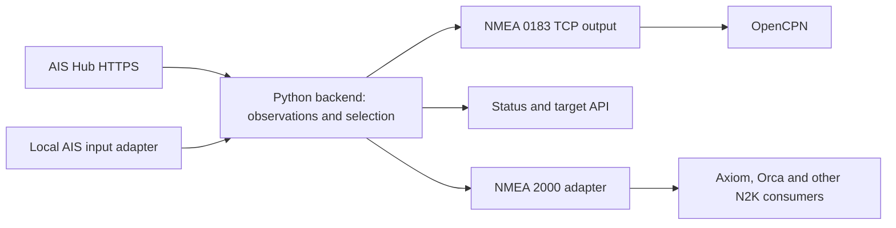

# Architecture

**First-release design, October 7, 2026.** Implementation and runtime tests await approval.

We are building a Python backend to retrieve Internet AIS - Over The Horizon (OTH) AIS, listen to our receiver and choose a position for each vessel.
Our first deployment runs the server in Docker on Linux with OpenCPN as a client.
A separate adapter sends additional OTH targets through Cerbo's NMEA 2000 connection.

## Shared backend and two outputs

The backend owns provider requests, normalized records, source priority, target expiry and status. Output adapters consume that same internal model. Only the N2K adapter needs a CAN interface. Linux desktop testing uses an explicitly configured geographic area and optional replayed local reception; it can operate while the boat's navigation equipment is off.

| Consumer | Output policy | Reason |
| --- | --- | --- |
| OpenCPN using this service as its AIS input | One merged stream: locally received observation preferred, otherwise eligible Internet observation | One target per MMSI through a single selected feed |
| OpenCPN with a separate direct local-AIS connection | Supplemental Internet-only stream, with backend local monitoring enabled | Preserve direct reception and suppress overlapping Internet reports |
| Existing NMEA 2000 backbone | Supplemental Internet-only AIS reports | The physical AIS receiver already delivers locally received targets |
| Target/status API | Selected observation plus separate source records, timestamps and suppression reason | Explain why a target appears, changes source or expires |

The physical transceiver-to-plotter connection stays intact. Local observations correct the backend's selected view; their position and static reports remain on their existing native N2K path. Every MMSI has separate local and provider records, preserving the origin of each observation.

## Python package and process boundaries

We are building a Python 3.11+ package with a Linux console executable, `oth-ais`, and a Docker image for the first Linux deployment. The same package runs on desktop Linux and Cerbo's Python runtime. `oth-ais serve` starts the common backend; `oth-ais can-agent` starts the CAN adapter when that output is configured. These commands define the first-release interface.

| Module | Responsibility |
| --- | --- |
| `models` and `selection` | Typed observations, source authority, clocks, expiry and per-target revision |
| `providers.aishub` | Regional HTTPS requests, account rate limit, bounded parsing and field normalization |
| `inputs` | Approved local NMEA 0183, N2K and replay inputs; own-position and receiver-health observations |
| `outputs.opencpn` | NMEA 0183 AIS encoding, TCP clients and per-client backpressure |
| `api` | Authenticated target details, status and validated operator settings |
| `n2k` | Local CAN receive, identity/address claiming, final suppression checks and allowed AIS output |
| `runtime` | Configuration, supervised lifecycle, resource budgets and structured incident logs |

Use `asyncio` for the backend and mature HTTP/server libraries such as `aiohttp`. Use [pyais](https://github.com/M0r13n/pyais) for AIS sentence encoding/decoding. The preferred N2K foundation is [python-can](https://python-can.readthedocs.io/) with [nmea2000](https://github.com/tomer-w/nmea2000), whose upstream `N2KDevice` supports address claiming and structured sending. Existing boat collection already uses these Python decoding/transport libraries. Pin and test the exact release, including AIS encoding, resource bounds and device lifecycle.

Keep the CAN adapter in its own supervised process, connected to the core by a versioned, bounded Unix-socket protocol. It retains local-MMSI reservations and final age checks beside the physical interface. A slow provider request or backend crash expires its publication lease. Library support remains subject to independent protocol tests; alternative established N2K stacks can implement the same adapter contract if needed.

Python packaging includes dependency hashes and the target-specific wheels needed on ARMv7, ARM64 and x86-64. Native dependencies, including `orjson` required by the candidate N2K library, need a compatible Cerbo wheel or a verified existing runtime import. Install into a separate service environment so existing electrical/navigation dependencies keep their versions.

## Internal observations

| Field group | Content |
| --- | --- |
| Identity | MMSI, source kind, provider/receiver identity and source device NAME where available |
| Position | Latitude/longitude, SOG, COG, heading and rate of turn, with explicit unknown values |
| Time | Source position time, UTC receipt time, monotonic receipt time and timestamp semantics |
| Static data | Name, callsign, vessel type, dimensions and independently timestamped metadata |
| Class | Verified AIS equipment class or unknown; evidence and chosen output encoding recorded separately |
| Selection | Selected source, last valid local position, five-/nine-minute deadline, receiver condition, target revision and expiry reason |

A selected position, motion and time form one observation from one source. Replacing a position with local reception preserves its associated motion and age. Static-field enrichment has separate provenance and timestamps. Missing fields retain their unavailable representation.

UTC determines position age. Monotonic clocks govern reservations, timeouts and publication leases. Duplicate snapshots and delayed/out-of-order reports preserve the actual observation time. Clock uncertainty pauses remote output until time becomes trustworthy again. Restarted services require fresh inputs before publication resumes.

## AIS Hub acquisition

Use regional HTTPS JSON requests with encoded units, bounded gzip handling and the provider age filter. A single backend owns the account's request schedule, with at least 65 seconds between all requests, including retries. Migration stops the previous account owner before starting the replacement; account-limit state survives normal restart through a small atomic state file.

A trusted own-position fix centres moving queries. A fixed, explicit bounding area supports desktop testing while instruments are off. Cross-date-line regions share the same account-wide request budget. Initial selection follows MMSI/source authority; search distance and output-radius filtering are explicit configurable choices.

The [documented provider schema](https://www.aishub.net/api) includes position timestamps and vessel type while leaving equipment class and original radio message ID unspecified. Inspect one actual account response before fixing the normalization contract. Timestamp meaning, coverage and class/raw-data options need recorded evidence.

Secrets stay in a private credential file. Keep TLS certificate verification enabled, validate redirects against approved provider hosts and redact credential-bearing URLs from logs and exceptions. Response limits apply to compressed bytes, decompressed bytes, JSON nesting and record/field counts. Incremental parsing and cooperative processing bound allocation and event-loop stalls.

## OpenCPN output and encoding

The desktop service provides newline-delimited `!AIVDM` sentences over TCP. The desktop configuration explicitly enables a loopback listener on port 10110; other deployments require their intended bind address and client-access policy. OpenCPN connects as a Network / TCP / NMEA 0183 input. Output from OpenCPN back into this connection remains disabled. A separate authenticated HTTP API exposes source, age and selection details; standard AIS sentences have limited provenance fields.

Use known Class A/B metadata to choose matching position and static messages. Verify every output through independent fixtures and a decoder, including reserved values, units and multi-sentence grouping. Serve a fresh selected snapshot on client connection, then updates; each target revision replaces its queued predecessor. Slow clients are disconnected before they accumulate old positions.

Unknown class needs an explicit encoding choice. **Desktop compatibility option:** encode its position as a gateway-generated Class A-format report while retaining `ais_class: unknown` and `encoding_basis: compatibility` internally. This gives OpenCPN the MMSI and position while its equipment-class display reflects our selected format. Operator configuration must explicitly enable this option; seeking provider class evidence remains the preferred path. The same choice requires owner approval and equipment tests before N2K use. Source timestamps and Internet origin remain visible in the API. Native OpenCPN support for NMEA tag-block time/source metadata needs its own test.

The encoder preserves real MMSIs and names. Unknown radio-state fields use specified unavailable values. Wire encoding never reconstructs a purported original radio report from undocumented fields. Emission is strictly local software/network output; community contribution uses independently received radio sentences.

See [OpenCPN testing](opencpn-testing.md) for the first working acceptance path.

## Local AIS coexistence

The [coexistence design](local-ais-coexistence.md) defines transitions and failure cases. Its core rules are:

1. Admit local observations only from approved receiver inputs, excluding own-vessel and gateway-origin reports
2. Match by MMSI and keep local/provider observations separately
3. Prefer a genuine local observation regardless of which source arrived later
4. On local arrival, update the merged OpenCPN view and cancel queued remote position/static output for that MMSI
5. Keep local position priority for five minutes for moving/unknown vessels, or nine minutes for confirmed anchored/moored vessels
6. After that window, use a fresh Internet position newer than the last local position; a confirmed receiver failure allows earlier fallback
7. Recheck local suppression in the CAN adapter immediately before transmitting each message

We track the last valid local position separately from names, class and other metadata. Static reports can improve vessel details while the position timer continues to run. Five and nine minutes are configurable fallback windows. Known anchored/moored status selects nine minutes; moving or uncertain status selects five minutes. Actual radio intervals vary with speed and equipment.

A missed vessel, a failed AIS receiver and a broken monitoring connection are different situations. A confirmed receiver failure permits immediate fresh Internet fallback. When monitoring is unavailable and the receiver's condition is uncertain, existing per-vessel deadlines continue; eligible Internet targets keep being published. Receiver health is reported to the operator and influences source selection. It stays separate from the CAN interface and the adapter's ability to transmit.

The Internet replacement must pass the configured position-age limit and be newer than the last trusted local position. An eligible cached record can be used immediately. If the Internet record is old or missing, retain the previous observation with its actual age until it expires. When local position reception returns, cancel queued Internet reports and select local again. See [coexistence](local-ais-coexistence.md) for receiver-failure and metadata-only cases.

The backend can retain an Internet observation for comparison and diagnostics while local reception owns the selected target. Conflicting local/Internet coordinates trigger a rate-limited discrepancy record; selection continues to follow local authority. Reports already transmitted remain in the client's cache, governed by its replacement and expiry behavior. Actual Axiom/Orca same-MMSI handover and target expiry must be measured.

## NMEA 2000 adapter

The adapter reads the already configured navigation interface and publishes allowlisted AIS reports plus bounded protocol-management messages for its own identity. It maintains a stable, unique device NAME, arbitrates its source address, handles fast packets and rechecks target revision, age, local suppression and lease at send time. It preserves host interface settings and stays isolated from the battery CAN connection.

Known Class A output uses PGN 129038 and supported static PGN 129794. Known Class B uses PGN 129039/129040 as appropriate and supported static PGNs 129809/129810. Missing data uses documented unavailable encodings. Claims of consumption by Axiom+, Orca Core 2 or another device require that device's actual rendering and handover test, recorded separately.

The CAN process receives local reports independently of backend/provider work. A valid local position cancels the target's Internet work locally and sends the cancellation to the core in the same receive event. Position and static output queues follow the selected position source. Local metadata updates vessel details while the position deadline keeps running. Gateway-origin NAME/address observations are excluded from local authority; changes in receiver source address follow its NAME. Passive receive mode opens the decoder/transport path alone. Starting the candidate `N2KDevice` initiates management transmissions, so its active lifecycle belongs exclusively to authorized output mode.

A fresh 15-second lease authorizes bounded remote publication. Lease renewal requires a responsive backend with valid selection state. The adapter checks position age, per-vessel fallback deadlines, receiver condition and the configured geographic area. Monitoring loss permits the defined Internet fallback. Broken CAN transmission, unresolved gateway identity, a broken backend lease, corrupt selection state or queue-overload uncertainty stop marine output. CAN sends use short deadlines; accepted frames in the kernel transmit queue are included in the handover-race measurement.

Desktop tests use a virtual CAN interface and an independent decoder. Cerbo tests then verify package startup, reception and measured resource use with transmission disabled. Actual Cerbo transmission, bus coexistence and Axiom/Orca consumption are scheduled for the powered navigation network aboard. Installation success and vCAN encoding establish their own evidence; physical-bus and display results remain separate checks.

## Resource and failure containment

We start with these configurable limits and measure them during implementation:

| Resource | Initial bound or behavior |
| --- | --- |
| Target state | 2,000 distinct MMSIs across provider records and local reservations; preserve active local suppression on pressure |
| Pending output | At most one latest revision per target and consumer; hard queue caps |
| Provider body | 2 MiB compressed / 8 MiB decompressed, bounded nested objects and strings |
| TCP clients | At most 8; 64 KiB queued per client; disconnect stalled readers |
| N2K target count | At most 100 eligible remote targets, configured independently of LAN visibility |
| CAN publication | At most 2 AIS PGNs/second and 20 frames/second, including a bounded management budget |
| CAN input | Kernel PGN filters and bounded receive batches; incomplete-message count/lifetime caps |
| Memory | Initial combined soft budget 128 MiB; hard budget 256 MiB; preserve 256 MiB host available-memory reserve |
| CPU | Low-priority OTH processes; sustained usage above 10% of one core for 60 seconds suspends provider/publication work |
| Scheduling | HTTP deadlines, bounded parse batches, event-loop-lag monitoring and independent CAN lease |
| Internet | Account-wide request limit, measured byte counters and configurable daily byte budget |
| Storage | RAM target state, small atomic configuration/rate-limit records and logs capped at 10 MiB |
| Recovery | Bounded retry/backoff; configuration/authentication failures wait for correction; crash loops stop with a clear incident |

Measure imported libraries and maximum-workload allocations before fixing production budgets. Use enforced OS/cgroup limits where supported by the actual Venus image; an external supervisor detects a blocked process. The low-priority/OOM policy selects OTH ahead of electrical services during pressure. Reserve exact host-level changes for deployment approval.

If local-suppression capacity fills, pause remote publication before evicting evidence needed to protect local vessels. Catch input/decode failures at adapter boundaries; treat invalid records separately from transport loss. Drain/close clients, revoke output leases and stop CAN sending on graceful shutdown. Process death expires output through the adapter lease or stops the adapter itself.

OTH has independent service supervision and receives its own provider credentials. Its authority is AIS observation and approved marine output. Existing battery, charging, autopilot and navigation configuration services retain their current interfaces and settings.

## Deployment and migration

| Stage | Host and evidence |
| --- | --- |
| First working release | Linux backend serving OpenCPN using real provider data and synthetic/local replays |
| Protocol verification | The same selections encoded into virtual CAN and independently decoded |
| Cerbo preparation | Package/runtime startup and resource checks; receive-only operation where navigation data exists |
| Next boat visit | Healthy powered N2K, supervised write test through Cerbo, Axiom and Orca consumption, local handover and failure checks |
| Later boat server | Move the same backend; retain a Cerbo CAN adapter with authenticated transport and bounded leases if useful |

On a split-host deployment, the CAN adapter owns final local suppression and receiver-side lease deadlines. Authenticate the transport, bound clock skew and maintain one fetcher and one publisher through migration. Local monotonic clock values remain local to each host.

Raymarine Ethernet, router VLANs, cameras and chart-package admission belong to their own projects. OTH delivery uses the existing LAN and marine interfaces. Vendor statements about display Ethernet networking remain documented support constraints; observed behavior needs a separate equipment test. Those questions stay outside OTH's implementation dependencies.

## Optional community contribution

After consent and provider acceptance of a mobile station, forward genuine received `!AIVDM` sentences to the provider-assigned UDP destination. Qualify the receiver output first: multiplexed external inputs can carry gateway-generated observations. Contribution accepts only trusted radio reception and excludes Internet records, gateway echoes, own-vessel `!AIVDO` and configuration commands. It uses a short bounded queue, discards old backlog on reconnect and reports uploaded bytes.

Contribution is a later adapter unless the account's access terms require an active receiver feed first. Optional Signal K/Home Assistant integration can consume the common API without acquiring another provider poller.

## Operator status and approvals

Expose provider status, last successful request, actual position ages, local receiver state, selected/suppressed counts, active output policy, encoding assumptions and resource/data counters. Report incidents in ordinary English with cause and consequence, then one settled recovery message. Routine polling stays in structured logs.

Design approval begins implementation of the Linux backend, OpenCPN integration and offline N2K tests. Installing a boat service, enabling receiver contribution, changing host/network configuration and transmitting on the live marine bus retain explicit owner approval. Physical write/display tests deferred to the boat visit remain visibly unperformed until observed.
