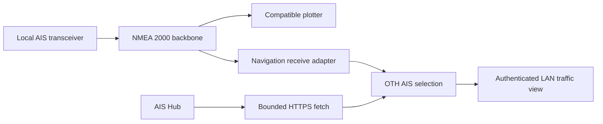
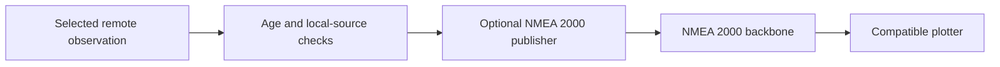
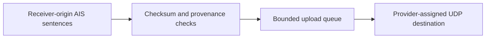

# Architecture

**Proposed design, October 7, 2026.** The first release provides Internet traffic awareness on the boat LAN. NMEA 2000 publication is a separately commissioned capability.

## Operating model

The existing AIS transceiver continues receiving nearby vessels and supplying the plotters directly. OTH AIS adds positions obtained through the Internet. A separate copy of each vessel's local and Internet observations preserves their origin, age and differences. Selection happens by Maritime Mobile Service Identity (MMSI), the vessel's radio identifier.

The recommended initial host is a Cerbo GX with an existing navigation CAN connection and measured spare capacity. A small Python service handles provider requests and target selection. A marine adapter handles navigation input and, after approval, NMEA 2000 output. Moving the Python service to a dedicated Linux server later preserves the same contracts.

## Independent data paths

The native transceiver-to-plotter path operates independently of OTH AIS. Its wiring and power stay intact. The optional publisher emits eligible remote targets only. Local targets already travel through the native path.

Optional publication connects to the same backbone after qualification:

Contribution uses a separate, one-way path:

## Service boundaries

| Component | Responsibility | Authority |
| --- | --- | --- |
| Provider adapter | HTTPS requests, account-wide rate limiting, schema validation and normalization | Outbound provider access |
| Navigation adapter | Own-vessel position, device identities and locally received AIS | Read navigation CAN or a receiver-output connection |
| Target store and selection | Separate observations, expiry, duplicate suppression and output eligibility | In-memory target state |
| LAN interface | Traffic records, source health, ages and operator controls | Authenticated read access; authorized configuration changes |
| Marine publisher | Final eligibility checks, address claiming, packet encoding and bounded transmission | Approved navigation interface and allowed AIS PGNs |
| Contribution adapter | Forward genuine receiver-origin sentences with a bandwidth budget | Assigned provider-upload destination |

Each input/output boundary has a typed contract. Selection and expiry are pure, clock-injected functions tested independently of network and hardware. Provider-specific fields stay inside their adapter.

A single navigation adapter supplies the local-target and own-position stream to all OTH components. Existing navigation collectors can consume the same normalized stream later. Reuse proven decoding and capture mechanisms through a small extraction or adapter; keep charging services independently deployed.

## AIS Hub access

Use HTTPS JSON regional queries with encoded-unit records, gzip responses and the provider's position-age filter. One account-wide limiter schedules requests at least 65 seconds apart, including retries and diagnostic queries. One active fetcher owns each account, including during host migration. A regional bounding box follows a fresh, trusted own-vessel position; exact distance filtering happens locally. Boundary splitting across the date line shares the same request budget. An explicitly configured fixed area supports LAN-only queries while vessel instruments are powered down.

The [provider contract](https://www.aishub.net/api) limits access to once a minute. Its age filter describes returned positions. `TIME` supplies the provider timestamp, and `TYPE` describes vessel type. The documented fields omit AIS class and original radio message ID. Actual account responses and timestamp semantics require qualification before output is enabled.

API account details enter through a private credential file. HTTPS certificate verification stays enabled. Logs redact credential-bearing query strings, response account identifiers and request-library exceptions containing URLs. Redirects require an approved provider host.

## Observations and time

Each position observation carries:

| Field group | Required content |
| --- | --- |
| Identity | MMSI, source kind, provider or receiver identity, source device NAME when available |
| Time | Provider/receiver timestamp, UTC receipt time, monotonic receipt time and timestamp semantics |
| Motion | Latitude/longitude in degrees, SOG in m/s, COG/heading in radians, each with validity |
| Provenance | Original AIS class/message type when verified, class-evidence source and age |
| Static data | Name, callsign, dimensions, vessel type and separately timestamped metadata |
| Lifecycle | Generation, expiry deadline and exclusion reason |

NMEA 2000 device NAME is the stable 64-bit device identity; its source address can change after reboot or address arbitration. Receiver identity follows NAME and an approved device inventory. The marine adapter supplies receipt timestamps and a qualified receiver-liveness signal alongside observations. Gateway-origin frames are identified by NAME and kept separate from receiver-origin data.

Normalization retains unknown values explicitly. It rejects invalid coordinates, malformed MMSIs, nonfinite numbers and implausible future timestamps. Sentinel tests cover provider and radio-specification differences, including unavailable speed encodings. An absent heading or rate of turn remains unknown. Static metadata can survive a position expiry with its own age.

UTC determines reported position age. Monotonic time governs timers and leases. A significant UTC clock jump disables remote publication until time is qualified again. Duplicate snapshots preserve the original age. Cached positions keep their source timestamp through restart and remain ineligible until fresh observations establish a new session.

## Local AIS priority

1. Keep observations separately under `(MMSI, source)` and render one selected vessel entry
2. Prefer an observed local VHF target while its local reservation remains active; show the observation's actual age
3. Reserve each locally seen MMSI for 15 minutes, accommodating slow stationary reports and short reception gaps
4. Stop queued Internet publication for that MMSI immediately when a local report arrives
5. Admit Internet targets to NMEA 2000 only with healthy local-receiver monitoring, a trusted own-position fix, verified class evidence and a fresh position
6. Exclude own-vessel MMSI and specialized identities such as AIS-SART, MOB, aircraft, base stations and aids to navigation from initial remote output

The LAN view can show the suppressed Internet observation in a details panel. Device disappearance, an unknown local-AIS sender or a broken local monitoring stream suspends Internet CAN output. Displaying zero local targets requires a healthy receiver observation path.

A target entering local range already has a remote entry on some plotters. Ceasing our transmission removes future interference; the plotter controls its cached entry and source handover. A commissioning test must prove its treatment of the same MMSI from both sources. Successful server-side selection alone establishes only our output behavior.

## Proposed policy defaults

These are initial commissioning choices, subject to approval and measured coverage.

| Setting | Proposal | Reason |
| --- | --- | --- |
| Provider polling | 65 seconds; 5 minutes in economy profile | Provider rate margin and optional energy/data savings |
| Search radius | 100 nautical miles | Regional traffic awareness |
| Remote CAN exclusion radius | 25 nautical miles around own vessel | Preserve the close-quarters picture for local sensors |
| Remote position age for CAN | At most 180 seconds | Bound delayed plotter positions |
| LAN fresh/stale display | Fresh through 180 seconds; stale until 10 minutes, then removed | Keep age visible during Internet interruptions |
| Local-MMSI reservation | 15 minutes | Protect slow reports and short receive gaps |
| Target bounds | 2,000 normalized records; at most 100 remote CAN targets | Bound memory and plotter congestion |
| Provider response bounds | 2 MiB compressed; 8 MiB decompressed | Bound download and decompression work |
| Publication budget | At most 2 AIS PGNs/second and 20 CAN frames/second; small burst allowance | Bound incremental bus traffic, including fast packets |
| Publisher lease | At most 15 seconds, renewed from fresh core decisions | Stop after controller/process communication loss |
| CAN transmission | Disabled until commissioning | Separate design approval from live activation |
| Community upload | Disabled until consent and provider acceptance | Preserve privacy and feed provenance |

The protected radius is a separation measure. Delayed positions can still produce misleading closest-point-of-approach calculations. Each plotter needs a documented Internet-source presentation and alarm behavior before shared-backbone publication.

## NMEA 2000 output qualification

Use an established NMEA 2000 stack for address claiming, fast packets, device information and field encoding. Timo Lappalainen's C++ library and its Linux SocketCAN driver are candidates. Pin reviewed revisions, retain their licenses and validate them against an independent decoder. Library selection remains an implementation decision after dependency review.

Known Class A reports map to PGN 129038 and, where supported, static/voyage PGN 129794. Known Class B reports map to PGN 129039 and supported static PGNs 129809/129810. Missing fields use their specified unavailable representation. Rate-of-turn conversion uses its documented nonlinear encoding. Original radio communication-state fields remain unknown when the provider supplies a normalized record.

AIS Hub's vessel-type field describes the vessel's use. Obtain radio-class evidence from a qualified raw-message feed or separately verified metadata. Records with unknown class remain available in the LAN view. PGN 129813, the long-range report, is an alternative research candidate: its format and actual plotter support require separate qualification, and its radio-message semantics constrain eligible station types.

**The main remaining constraint is provenance on the plotter.** Standard AIS position PGNs carry limited time information, and displays can treat newly received old data as current. A distinct CAN source NAME identifies the bridge on the bus; its visibility in the plotter's target details and alarm engine needs an equipment test. Preserve the true MMSI and vessel name. Keep Internet source labels in the LAN view and use native display support where available.

Live output requires all of the following:

- A healthy, already configured navigation interface at 250 kbit/s and an approved local-AIS receiver identity
- A unique bridge NAME and reviewed manufacturer/product identifiers, followed by successful address arbitration
- Verified field mapping and class evidence for every admitted target
- Proven local-MMSI handover, stale-target expiry and display-source behavior
- A measured bus budget and an operator control that immediately stops remote transmission
- Explicit owner approval of the resulting display and alarm behavior

The publisher rechecks target age, lease, own-position validity and local reservations at send time. It flushes queued targets on source failure, moves to a new generation after restart and sends each unchanged observation at most once per session. Prioritize eligible targets by distance, then source age, with bounded fair scheduling. It can send allowlisted AIS reports and the protocol-management messages required for its own identity. Configuration keeps battery, charger, autopilot, route-control and own-GNSS publication outside its authority.

If the display offers insufficient provenance or safe handover, keep remote traffic on the source-aware LAN view or investigate a separate display connection. A certified gateway remains an alternative when production requirements exceed a custom SocketCAN implementation. Open-source availability and standards conformance require separate evidence.

## Hosting and resource isolation

The first build targets the measured Cerbo Python runtime using a small Python package and a separately supervised marine adapter. A full Signal K server can run on the eventual boat server; OTH AIS can publish source-labelled Signal K observations there through an optional adapter.

| Provisional admission budget | Requirement |
| --- | --- |
| Combined process resident memory | At most 64 MiB during the qualification workload |
| Cerbo available-memory reserve | At least 256 MiB; pause OTH work before crossing the reserve |
| CPU | Under 5% of one core averaged over 10 minutes, with bounded parsing bursts |
| Flash writes | Capped configuration/audit writes and rotated logs; target cache in RAM |
| Charging coexistence | Unchanged controller/watchdog health and telemetry cadence during qualification |

These are acceptance targets. Measurements determine admission. The supervisor disables OTH services when budgets are exceeded and preserves the existing electrical services. Use separate process supervision, bounded queues and OS resource controls supported by the actual Venus image. OTH receives neither charging credentials nor D-Bus write permissions. A CAN writer's interface/PGN allowlist provides an application boundary; its strength also depends on the host's process permissions.

When the dedicated server arrives, move fetching, selection and the LAN interface there. Cerbo can retain a small navigation adapter after qualification, connected through mutually authenticated TLS and short-lived output leases. Keep local receiver health and final expiry checks beside the physical CAN interface. Cross-host messages use UTC validity and a bounded receiver-side monotonic lease; monotonic clock values stay local to each host. Only one active publisher owns a bridge identity during migration.

## Networks and charts

The services host belongs on the operations LAN. Raymarine radar/sonar discovery remains within the navigation Ethernet segment. Cameras retain their own planned segment. Inter-segment rules permit explicitly needed crew, application and camera access; multicast forwarding requires a demonstrated use case.

AIS Hub fetching follows existing WAN/VPN policy. OTH changes neither WAN selection nor routing. NMEA 2000 delivery uses the marine CAN connection. RayNet carries Raymarine's Ethernet data and shares supported instrument data through the designated data-master plotter. Ethernet cabling alone establishes a physical path; each application requires its supported protocol.

Raymarine documents `198.18.0.0/21` for its modern private navigation Ethernet network, with a separate reserved self-address range. Its legacy E-Series Classic and Axiom Ethernet-sharing restriction requires a separate legacy segment. Verify the exact E120 generation before changing cabling. Common instrument/AIS access follows each display's supported NMEA connections.

Offline chart assets remain owned by the chart project. OTH exposes georeferenced, source-labelled traffic so a compatible viewer can overlay it on approved nautical or satellite layers. Provider licensing and LightHouse-native chart admission remain separate qualification steps.

## Contribution, privacy and connectivity

AIS Hub's [sharing workflow](https://www.aishub.net/) supplies a UDP upload destination after station registration. Confirm acceptance of a mobile vessel station, privacy expectations and continued API entitlement with the provider.

Prefer genuine received `!AIVDM` sentences from a dedicated receiver-output connection. Confirm Linux USB operation or a receive-only NMEA 0183 connection on the installed receiver. Some equipment multiplexes externally supplied data, so qualify the output's provenance before forwarding. Own-vessel `!AIVDO`, configuration sentences, Internet observations and our gateway output stay excluded from the initial contribution feed.

NMEA 2000-to-0183 reconstruction is a later option requiring provider acceptance and tests for fidelity. Receiver framing, original timestamps and channel details may be lost through conversion. The upload queue drops old records during outages and resumes with current reception. Upload rate and daily byte counters expose its cost; provider-quality requirements determine any permitted sampling.

Normal, economy and disabled profiles adjust Internet polling and optional contribution independently. Local AIS continues through the existing equipment. At 20 KiB per minute, provider payloads total about 28 MiB/day; at 100 KiB they total about 141 MiB/day. These examples exclude transport overhead. Measure actual downloads and contribution separately before assigning a daily data budget.

## Failure behavior and operator view

| Condition | Result |
| --- | --- |
| Internet loss, authentication rejection or rate limit | Back off within the account limit; age and expire remote positions; retain local observations |
| Empty valid regional result | Report query success and zero returned targets |
| Empty body, malformed schema or response-size limit | Record provider failure, preserve observation timestamps and expire normally |
| Stale/invalid own position | Freeze the displayed search centre with its age; suspend moving-area queries and CAN publication |
| Local receiver monitoring failure | Suspend remote CAN publication; identify the missing receiver or input |
| CAN error state, identity collision or excessive bus load | Stop remote transmission and flush its queue; leave existing interface settings untouched |
| Core crash, broken adapter link or expired lease | Publisher stops within its lease deadline |
| Host reboot or storage failure | Start in receive/display mode; qualify time, sources and a fresh generation before optional output |
| Low memory or electrical-service regression | Stop OTH services and report the resource/coexistence failure |

The operator sees local and Internet target counts, last provider success, position ages, local receiver health, transmitted/suppressed counts, data usage and a concise publication state. An empty provider result represents available data for the query region; actual receiver coverage remains a separate uncertainty.

Alerts describe the event and consequence: `Warning: Internet AIS output paused: local receiver data stopped. Last receiver observation: 2 minutes ago.` Recovery notices combine the transition and settled status. Use cooldowns and one recovery message per incident. Routine polling remains in structured logs and counters.

## Approval boundary

Architecture approval authorizes implementation of the read/display service and offline protocol tests. Installing a boat service, enabling contribution, changing network configuration and transmitting on a live marine bus each require their own explicit approval. The [implementation plan](implementation-plan.md) defines evidence for those decisions.
