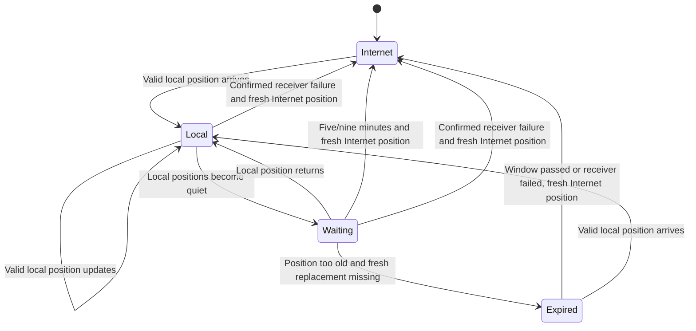

# Local AIS coexistence

**Proposed behavior, October 7, 2026.** We identify each vessel by its MMSI and keep its local and Internet observations separately. While local AIS has a recent position, we use it. If we lose that position feed, we want to keep showing the vessel through a fresh Internet report. This document describes when we change source and how we handle the return of local reception.

## Receive once, select once

The CAN adapter listens to the existing backbone, receiving the local AIS transceiver's reports alongside its own output. It feeds approved local observations to the common Python backend and maintains a small local suppression table itself. A configured direct NMEA 0183 receiver input can provide the same contract on another host.

Receiver approval follows a qualified CAN device NAME or a dedicated input identity. CAN source addresses can change; address claims update the mapping. Own-vessel reports, the bridge's own NAME and observations arriving from its output connections stay excluded from local authority. A receiver's multiplexed USB/NMEA output needs an echo/provenance test before it becomes authoritative.

Input parsing preserves received-versus-own transceiver flags, class, message type, receipt time and available radio time. Specialized stations such as AIS-SART, MOB, aids to navigation, base stations and aircraft remain on their native local paths; the initial Internet publisher admits ordinary vessel targets only.

## Different consumers need different output

| Situation | Backend action | N2K action |
| --- | --- | --- |
| Fresh Internet target, no local reservation | Select the Internet observation | Publish eligible Internet reports |
| First genuine local position for the same MMSI | Select local position/motion/time immediately | Cancel queued Internet position and static reports |
| Internet update during the local position window | Keep it available as a fallback record | Continue to suppress its output for this MMSI |
| Local report briefly delayed | Display the last local observation with its actual age | Keep the local reservation |
| Local position missing through the five-/nine-minute window | Use an eligible, fresh Internet position | Publish the Internet replacement after send-time checks |
| Confirmed AIS receiver failure | Use eligible, fresh Internet positions immediately | Continue Internet publication on the working CAN interface |
| Monitoring connection lost; receiver condition uncertain | Report the connection problem and continue per-vessel timers | Continue eligible Internet publication as those timers expire |
| Bridge-origin or reflected output observed | Reject it as local evidence; report a loop if needed | Preserve local authority and stop uncertain output |

For OpenCPN's merged connection, the selected local observation is emitted to the desktop client. On the physical N2K backbone the transceiver already supplies that report; OTH sends only supplemental Internet observations. These are separate output policies over the same source selection.

Position reports and vessel details have separate jobs. A valid local position starts or renews its source-priority window. A local name, class or dimension report enriches the vessel details while the position timer continues to run. A vessel heard only through static reports can use a fresh Internet position immediately, with local details added where appropriate. We retain the origin and time of each field.

## Per-MMSI lifecycle

The fallback window starts from the last valid local position report. Both values are configurable:

| Vessel state | Time without a local position before Internet fallback |
| --- | --- |
| Moving, underway or state uncertain | Five minutes |
| Known anchored or moored, with plausible motion | Nine minutes |

Use a reliable navigation status to identify anchored/moored vessels. Class B reports can omit that status; uncertain cases use five minutes. A newer credible report showing movement can shorten the deadline to five minutes. A new local position starts the next window. Static metadata leaves the existing deadline unchanged.

These windows give intermittent radio reception room to recover. [Radio reporting intervals](https://www.navcen.uscg.gov/types-of-ais) vary with speed and equipment. Our timers measure elapsed time since the last valid position. Position age and source priority are separate: an old local position may expire before its priority window ends.

When the window ends, use an Internet position within its configured maximum age and newer than the last trusted local position. A valid record already in memory can be used immediately. When the local position lacks a reliable absolute timestamp, use local receipt time as the comparison floor with documented clock tolerance. A cached duplicate or older position stays ineligible. If both sources have lost the vessel, keep its actual age visible and let it expire.

A confirmed AIS receiver failure permits earlier fallback for affected vessels. Confirmation can come from an explicit device fault or the operator reporting that the receiver has failed or been powered off. A missing monitoring heartbeat or a closed input socket indicates uncertainty and keeps the ordinary five-/nine-minute timers running. Internet-only vessels continue to be published throughout.

As soon as valid local position reception returns, local takes priority again and its queued Internet output is cancelled. The status API records the source change, the receiver condition and both observation times.

Distance alone grants no source authority. A radio report received far away still takes priority; an Internet-only vessel nearby can remain eligible subject to freshness and the explicitly selected output policy. Output radius is a configurable operational choice.

## Cancellation and the send race

Every target has a monotonically increasing revision within a service generation. A valid local position increments the revision, starts its local-priority window and coalesces/cancels pending Internet work for both position and static data. Changing to Internet fallback also increments the revision, preventing old local-selection work from leaking into the merged output.

The CAN adapter performs the same cancellation directly from its receive callback, independently of provider/backend processing. Before every new message it checks the selected source, per-vessel deadline, target revision, position age, configured geographic area and backend lease. A changed or rejected item leaves the queue. Receiver failure/fallback state is part of the versioned core-to-adapter contract, so both processes make the same decision.

A message already accepted by the kernel can finish transmission after local reception. Fast packets can also be part-way through a multi-frame send. Use short send deadlines and minimal queued CAN work, then measure that residual window during virtual and physical handover tests. Sequence numbers, source address and cancellation must leave other devices' packet reassembly healthy.

Further Internet sends for that MMSI stop after the adapter processes a valid local position and establishes its priority window. The display may still hold a recently sent Internet report. We need to observe how each display replaces and expires it; standard AIS/N2K output leaves target removal to the client.

## Receiver failure and a broken monitoring connection

Depth and wind can keep arriving while the AIS receiver is missing. We therefore watch a signal from the approved receiver itself, such as periodic GNSS/status output or a supported heartbeat. Check which signal the installed transceiver provides and its usual timing. If passive reception provides insufficient information, qualify a bounded management-health check or report the receiver condition as uncertain.

Keep separate status for the CAN interface, receiver condition, monitoring connection and number of local vessels. Zero vessels can be normal open water. A failed receiver permits fresh Internet fallback; a lost monitoring connection permits fallback through the per-vessel timers. The absence of local AIS stays visible to the operator while Internet tracking continues.

During a monitoring failure, the physical receiver may still be reporting vessels to the displays. Supplemental Internet positions can therefore overlap native reports until monitoring recovers. We accept that possibility to retain fresh vessel information and will test the displays' handling of it. The service's API identifies Internet fallback and the monitoring problem; native display source labels require their own device test.

Malformed records are rejected individually. If reception can no longer be decoded reliably, report monitoring as unavailable and use the fallback rules. A broken transmit interface, expired backend lease, unresolved gateway identity, detected forwarding loop or corrupt selection state stops marine output. Those faults affect our ability to send valid reports. Capacity handling preserves unexpired local-priority state. If state tracking loses integrity, stop uncertain publication and report the cause.

## Conflicts and identity

Conflicting coordinates or equipment class under the same MMSI can indicate provider delay, identity reuse, bad receiver data or a forwarding loop. Follow the position windows and source-selection rules, retain both observations and expose their separation, times and receiver identity. Rate-limit repeated discrepancy notices.

Two local receivers require a configured receiver-priority policy. Their observations remain separate, and valid position reception from either starts the local window. Position freshness and configured priority select the merged desktop record. A fault on one receiver leaves the other receiver's recent position in control.

Restart clears output queues and leases. Restore recent local-position times and deadlines from valid saved state; validate UTC/time uncertainty before converting them to new monotonic deadlines. With unavailable prior state, use a finite configured listening window covering expected slow reports. After that window, fresh Internet targets can be published even if local monitoring is unavailable. A confirmed receiver failure permits earlier fallback. Corrupt state is reported and discarded, with a fresh listening window. Returning local positions immediately take priority.

## Contribution and loops

Contribution accepts genuine receiver-origin `!AIVDM` sentences through a qualified path. Internet observations and generated OpenCPN/N2K output use separate origin types and queues. The upload boundary rejects derived output regardless of how recently it was produced.

Watch for gateway reflections through receiver USB multiplexing, OpenCPN repeaters or other N2K/0183 bridges. Identify the bridge's own source identity and configure feeds one-way. A bounded recent-output fingerprint cache can detect suspicious reflections; matching bytes alone remain ambiguous because a genuine report may contain the same fields. Qualify the physical/source path and pause uncertain output until its origin is established.

## Required tests

1. Internet then local for one MMSI: merged desktop changes to local and both remote CAN queues stop
2. Local then Internet during the local position window, including newer API receipt: local remains selected
3. Metadata-only local reception: details update while Internet positions remain eligible; valid local position starts suppression
4. Check just before, exactly at and after five/nine minutes; cached fresh Internet replacement works and older replacements remain rejected
5. Confirmed receiver failure permits immediate eligible fallback; monitoring loss uses the timers; healthy zero-target reception stays distinct
6. Receiver address change, bridge echo and multiplexed input: correct identity handling and zero false local promotion
7. Queue pressure, restart, lost state and clock changes: bounded memory, finite recovery and correct fallback deadlines
8. Local arrival during a multi-frame send: residual frames measured and subsequent target sends suppressed
9. Actual Axiom/Orca cache handover and stale-target expiry: record each consumer separately
10. Returning local positions cancel Internet fallback; movement shortens a nine-minute deadline; failure of one local receiver preserves another's recent position

Desktop replay and virtual CAN cover the selection and timing cases. The next powered-network visit supplies physical transport, overlap and display evidence.
