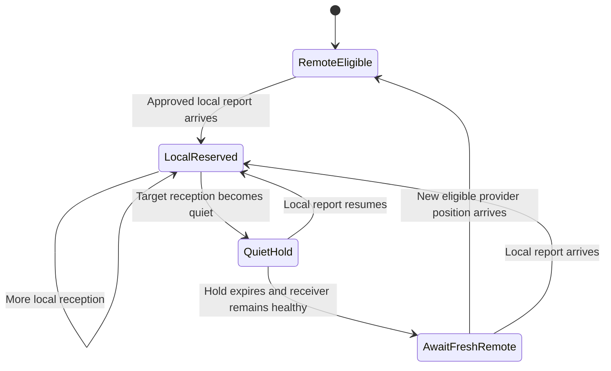

# Local AIS coexistence

**Proposed behavior, October 7, 2026.** Each vessel is identified by its MMSI. Genuine local reception owns that vessel's selected observation and suppresses supplemental Internet reports. The backend keeps both source records, preserving local authority through later API snapshots.

## Receive once, select once

The CAN adapter listens to the existing backbone, receiving the local AIS transceiver's reports alongside its own output. It feeds approved local observations to the common Python backend and maintains a small local suppression table itself. A configured direct NMEA 0183 receiver input can provide the same contract on another host.

Receiver approval follows a qualified CAN device NAME or a dedicated input identity. CAN source addresses can change; address claims update the mapping. Own-vessel reports, the bridge's own NAME and observations arriving from its output connections stay excluded from local authority. A receiver's multiplexed USB/NMEA output needs an echo/provenance test before it becomes authoritative.

Input parsing preserves received-versus-own transceiver flags, class, message type, receipt time and available radio time. Specialized stations such as AIS-SART, MOB, aids to navigation, base stations and aircraft remain on their native local paths; the initial Internet publisher admits ordinary vessel targets only.

## Different consumers need different output

| Situation | Backend action | N2K action |
| --- | --- | --- |
| Fresh Internet target, no local reservation | Select the Internet observation | Publish eligible Internet reports |
| First genuine local position for the same MMSI | Select local position/motion/time immediately | Cancel queued Internet position and static reports |
| Internet update after local reception | Retain it as a separate comparison record | Keep its output suppressed |
| Local report briefly delayed | Display the last local observation with its actual age | Keep the local reservation |
| Local input healthy, target quiet through the hold | Consider a newly fetched, fresh provider position | Resume only after send-time checks |
| Local input monitoring unhealthy | Show receiver fault and actual ages | Pause all supplemental Internet output |
| Bridge-origin or reflected output observed | Reject it as local evidence; report a loop if needed | Preserve local authority and stop uncertain output |

For OpenCPN's merged connection, the selected local observation is emitted to the desktop client. On the physical N2K backbone the transceiver already supplies that report; OTH sends only supplemental Internet observations. These are separate output policies over the same source selection.

Local static messages from an approved receiver also reserve their MMSI and cancel Internet static/position publication. They establish local reception while leaving the existing position's timestamp unchanged. Until a genuine local position arrives, the API shows the reserved target with position unavailable or its previous observation explicitly aged; queued publication stays suppressed. A fresh dynamic local report supplies the selected position when available.

## Per-MMSI lifecycle

The quiet hold starts from the latest genuine local reception. Its initial proposal is 15 minutes, accommodating slow stationary reports and short receive gaps. Receiver-health failure pauses global remote output without releasing existing reservations. A static report can renew reception authority while position freshness continues to age separately.

On release, require a provider fetch completed after the hold expired, a fresh source position and a position timestamp later than the last trusted local position time. When only local receipt time is available, use that conservative time floor with documented clock tolerance. A duplicate or older provider position remains ineligible. If there is no fresh replacement, leave the target expired/unknown.

Distance alone grants no source authority. A radio report received far away still takes priority; an Internet-only vessel nearby can remain eligible subject to freshness and the explicitly selected output policy. Output radius is a configurable operational choice.

## Cancellation and the send race

Every target has a monotonically increasing revision within a service generation. Local arrival increments the revision, marks the MMSI reserved and coalesces/cancels pending Internet work for both position and static data.

The CAN adapter performs the same cancellation directly from its receive callback, independently of provider/backend processing. Before every new message it checks its local reservation, target revision, position age, own-position validity and backend lease. A changed or rejected item leaves the queue.

A message already accepted by the kernel can finish transmission after local reception. Fast packets can also be part-way through a multi-frame send. Use short send deadlines and minimal queued CAN work, then measure that residual window during virtual and physical handover tests. Sequence numbers, source address and cancellation must leave other devices' packet reassembly healthy.

The guarantee is that further eligible sends stop after the adapter processes genuine local reception. The display's cache and its treatment of a recently sent remote report require their own observation. Standard AIS/N2K output offers no general target-delete instruction; expiration and source replacement follow client behavior.

## Health and zero-target reception

A healthy bus can carry depth or battery data while the AIS receiver is missing. Receiver health therefore follows a qualified signal from the approved receiver, such as its periodic own-GNSS/status output or supported heartbeat. Identify that signal and its normal cadence on the installed transceiver. If passive reception lacks such a signal, qualify an explicit management-health check before enabling marine output.

Keep separate status for bus/interface health, approved receiver health, raw input transport and number of local targets. Zero local targets can represent normal open water when the receiver's health signal continues. A connected TCP socket or a recent unrelated CAN frame provides insufficient receiver evidence.

Malformed records remain isolated to their parsing boundary. Source-identity ambiguity, sustained reassembly loss, suspected loops or dropped authority events pause remote output and report the reason. Never evict an active local reservation merely to admit more Internet vessels; capacity uncertainty pauses supplemental publication.

## Conflicts and identity

Conflicting coordinates or equipment class under the same MMSI can indicate provider delay, identity reuse, bad receiver data or a forwarding loop. Select approved local reception, retain the conflicting provider observation separately and expose the separation, source times and receiver identity. Rate-limit repeated discrepancy notices.

Two local receivers require an explicit receiver-priority policy. Their observations remain separate, and either receiver's genuine reception establishes a local reservation. Observation freshness and configured priority select the merged desktop record.

Restart invalidates output queues and leases. Require fresh receiver health and a configured local-reception warm-up before supplemental N2K output; retained reservation state, if available, preserves its timestamps. An empty or unavailable prior state uses a conservative warm-up covering the expected slow-report cadence. Corrupt state is reported and discarded explicitly.

## Contribution and loops

Contribution accepts genuine receiver-origin `!AIVDM` sentences through a qualified path. Internet observations and generated OpenCPN/N2K output use separate origin types and queues. The upload boundary rejects derived output regardless of how recently it was produced.

Watch for gateway reflections through receiver USB multiplexing, OpenCPN repeaters or other N2K/0183 bridges. Identify the bridge's own source identity and configure feeds one-way. A bounded recent-output fingerprint cache can detect suspicious reflections; matching bytes alone remain ambiguous because a genuine report may contain the same fields. Qualify the physical/source path and pause uncertain output until its origin is established.

## Required tests

1. Internet then local for one MMSI: merged desktop changes to local and both remote CAN queues stop
2. Local then Internet, including newer API receipt: local remains selected
3. Static local reception followed by dynamic reception: suppression begins immediately and position time stays truthful
4. Short gaps, slow anchored reports and full quiet expiry: reservations release only through the defined transition
5. Interface healthy but receiver absent; receiver healthy with zero targets: distinct status and output behavior
6. Receiver address change, bridge echo and multiplexed input: correct identity handling and zero false local promotion
7. Queue pressure, restart, lost state and clock changes: bounded memory and conservative output recovery
8. Local arrival during a multi-frame send: residual frames measured and subsequent target sends suppressed
9. Actual Axiom/Orca cache handover and stale-target expiry: record each consumer separately

Desktop replay and virtual CAN can establish tests 1-8 in controlled conditions. The next powered-network visit supplies physical transport and consumer evidence, including test 9.
